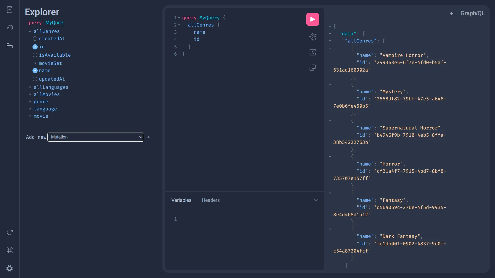

# **Prototype GraphQL**



- [Graphene Python](https://graphene-python.org/)

## **What is GraphQL?**

GraphQL is a query language for APIs and a runtime environment that allows clients to fetch exactly the data they need in an efficient and flexible way. It was developed by Facebook in 2012 and open-sourced in 2015. Unlike traditional REST APIs, GraphQL enables:

- **Custom queries**: Clients can specify exactly which data they need, avoiding the problem of over-fetching or under-fetching data.
- **A single source of truth**: All entities and relationships are managed through a unified schema, allowing clients to access multiple resources in a single query.
- **Easy API evolution**: GraphQL APIs can adapt without breaking existing clients by adding or changing fields in the schema.

## **Key Features**

- **Typed Schema**: GraphQL uses a strict type system to define the shape and structure of the data that can be queried.
- **Queries and Mutations**:
  - **Queries**: Used to fetch data.
  - **Mutations**: Used to make changes (create, update, or delete data).
- **Subscriptions**: Allow handling real-time data updates via WebSockets.
- **Efficient Data Resolution**: Resolvers define how to fetch data for each field in the schema.
- **Reduced HTTP Requests**: A single query can retrieve data from multiple related sources, optimizing performance.

## **Why Use GraphQL?**

1. **Flexibility**: Clients have full control over the structure of the response.
2. **Scalability**: Ideal for complex projects with many entities and relationships.
3. **Efficiency**: Reduces data overhead and the number of server requests.
4. **Automatic Documentation**: The GraphQL schema acts as self-generated, always up-to-date documentation.

## **Example**

**Query:**

```graphql
query {
  movie(id: 1) {
    title
    year
    director {
      name
    }
    genre {
      name
    }
  }
}
```

**Response:**

```json
{
  "data": {
    "movie": {
      "title": "Inception",
      "year": 2010,
      "director": {
        "name": "Christopher Nolan"
      },
      "genre": {
        "name": "Science Fiction"
      }
    }
  }
}
```
